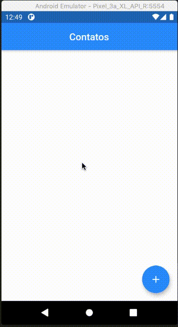

### Exemplo de agenda de contatos feito em Flutter framework

 
Este código foi criado para o meu livro entitulado
"Iniciando com Flutter Framework, desenvolva aplicações móveis no Dart Side!
" Publicado pela editora Casa do Código.  :nerd_face::nerd_face::nerd_face:

:point_right: Se você quer saber mais sobre o meu livro
[click aqui](https://www.casadocodigo.com.br/products/livro-flutter)

:us: Quer ler a versão em inglês? [click aqui](https://github.com/Leomhl/flutterbook_agenda/blob/master/README.md)

